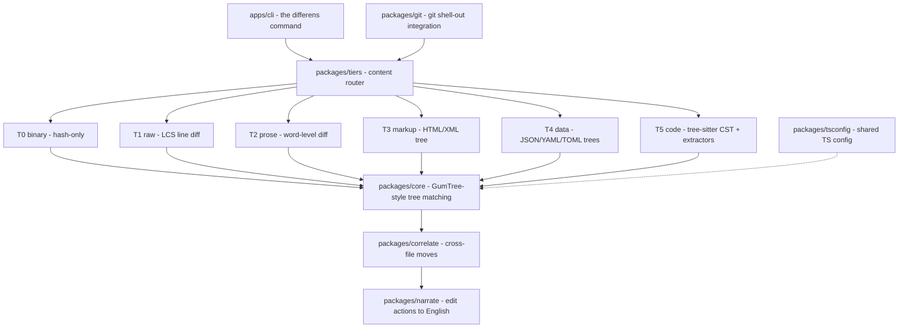

# Contributing

Thanks for wanting to make Differens better. This guide covers everything from your first clone to shipping a release.

## Code of conduct

Be respectful. Differens is a small project maintained by people with day jobs, so:

- Assume good intent in reviews and discussions
- Give constructive feedback — say what is wrong and why, not just that it is wrong
- Be patient: maintainers review in their spare time
- Keep discussions on the topic of the project

Harassment, trolling, and personal attacks are not welcome in issues, PRs, or discussions.

## Getting started

Clone the repo and install dependencies:

```bash
git clone https://github.com/ossl-dev/differens
cd differens
bun install
```

Prerequisites: **Bun >= 1.3** (`bun --version` to check) and **Git** (needed for the git integration tests).

Verify everything works:

```bash
bun run build      # Build all packages
bun run test       # 100+ tests across 6 packages — must be zero failures
```

Per-package tests run faster when you are iterating on one area:

```bash
bun test packages/core/src/
bun test packages/tiers/src/
```

<Info>
No build step is needed to run the CLI from source — Bun runs TypeScript directly:

```bash
bun run apps/cli/src/index.ts <inputs>
```
</Info>

## Making changes

1. **Pick or open an issue.** Say what you want to work on so nobody else starts the same thing.
2. **Branch from `main`.** Give the branch a short descriptive name.
3. **Write code + tests.** Every behavior change gets a test.
4. **Run `bun run test`** — must be all green.
5. **Run `bun run lint`** — must be clean (Biome).
6. **Open a PR against `main`.** Reference the issue in the description.

### Commit style

Human-readable, past-tense, lowercase after the first word. Think of the commit message as a sentence describing what the diff did.

Good:

- `Added Python extractor for async/await node types`
- `Fixed root-level insertion not emitted when parent is null`
- `Replaced recursive tree walk with iterative stack to avoid stack overflow`

Avoid:

- `fix: root insert` — too terse, does not say what or why
- `Implemented comprehensive solution for edge case handling in the tree matching subsystem` — too verbose to skim

### Formatting

Biome handles formatting and linting. Run `bun run format` before committing, or let your editor do it on save.

## Adding a language extractor

Extractors map tree-sitter node types to canonical concepts (`Function`, `Class`, `Method`, `Import`, ...) so diffs read as "renamed method" instead of "renamed node `method_definition`". Languages without an extractor still work — they fall back to structural diff with raw tree-sitter node labels.

1. Create `packages/tiers/src/code/<language>.ts`
2. Implement the `LanguageExtractor` interface from `extractor.ts`
3. Map tree-sitter node types to canonical concepts (Function, Class, Method, Import, etc.)
4. Register the extractor in `code/index.ts` `ensureInitialized()`
5. Add tests in `packages/tiers/src/index.test.ts`
6. Run `bun test packages/tiers/src/`

## Adding a tier adapter

Adapters sit on the abstraction ladder: T0 is raw bytes, T5 is code. Each tier parses its content into a `Node` tree that the one diff core consumes — the core never cares where its input came from.

1. Create the adapter in `packages/tiers/src/`
2. It must produce a `Node` tree (see `packages/core/src/index.ts` for the interface)
3. Register it in the `diffWithTier()` switch statement in `packages/tiers/src/index.ts`
4. Add to `classifyFile()` if it has specific file extensions
5. Pick a tier number that reflects its position on the abstraction ladder (T0=bytes, T5=code)
6. Add tests in `packages/tiers/src/index.test.ts`

<Info>
Graceful degradation is a core design rule: every tier can fall back to the one below it. A new adapter should never leave a file type un-diffable — the tool never crashes or refuses to produce an answer.
</Info>

## Project structure



A textual map of the same layout:

```
differens/
├── packages/
│   ├── core/          # Node hashing + GumTree-style tree matching
│   ├── tiers/         # Content router + 6 tier adapters (T0-T5)
│   │   ├── binary.ts  # T0: binary detection (hash-only)
│   │   ├── raw.ts     # T1: LCS line diff (safety net)
│   │   ├── prose.ts   # T2: word-level prose diff
│   │   ├── markup.ts  # T3: HTML/XML tree parser
│   │   ├── data.ts    # T4: JSON/YAML/TOML value trees
│   │   └── code/      # T5: tree-sitter CST + per-language extractors
│   │       ├── extractor.ts    # LanguageExtractor interface
│   │       ├── typescript.ts   # TS/JS semantic extractor
│   │       ├── python.ts       # Python semantic extractor
│   │       ├── rust.ts         # Rust semantic extractor
│   │       └── go.ts           # Go semantic extractor
│   ├── narrate/       # Template engine: edit actions -> English
│   ├── correlate/     # Cross-file move/rename detection
│   ├── git/           # Git shell-out integration
│   └── tsconfig/      # Shared TypeScript config
├── apps/
│   └── cli/           # The `differens` command
├── turbo.json         # Turborepo pipeline
├── biome.json         # Formatter + linter config
└── package.json       # Root workspace config
```

**Starting points:** `packages/core/src/index.ts` for the matching algorithm; `packages/tiers/src/index.ts` for the content router and adapter pipeline.

## Release process

Seven packages go out in dependency order: the five libraries, then the CLI under both `differens` and `@ossl-dev/differens-cli` from one build.

From the repo root:

```bash
bun run release -- --dry-run   # preview first
bun run release
```

Everything after `--` passes through to `npm publish`, so `--otp=123456` is how a one-time code gets in when the account uses app-based 2FA. A passkey has no code: npm falls back to a browser challenge, which needs a real terminal — run releases from your own shell, not from a CI step or a pipe.

The release is resumable: a version already on the registry is skipped rather than retried, and a scope the account cannot publish into skips only its own packages. `scripts/publish.ts` stages each publish into a temp directory and never rewrites the repo manifests, so an interrupted run cannot leave the workspace half-published.

## Where to ask questions

- **GitHub issues** — bugs, feature requests, and questions about behavior. Search first; your question may already be answered.
- **Pull requests** — discuss code changes in the PR thread.
- **The repository itself** — `DEVELOPMENT_GUIDE.md` at the repo root is the source of truth for development workflow and architecture notes.
