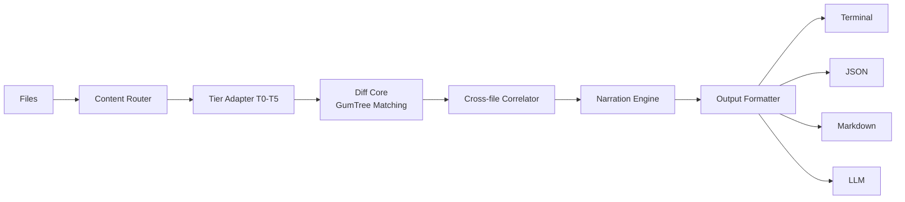

# Architecture

Differens is one diff core with many adapters in front of it. Every tier parses input into a `Node` tree. One tree-matching algorithm consumes those trees. The core accepts trees from any source: git, two files, or two directories. Parsers do not know how matching works.

## The pipeline

### 1. Content router

The router classifies each input file by extension and dispatches it to a tier adapter. `.ts` goes to T5 code, `.json` to T4 data, `.html` to T3 markup, `.md` to T2 prose, everything else to T1 raw. Binary detection runs first on anything that fails the text sniff. The router is the only place that maps extensions to parsers. Adding a new format means adding a classification rule, not touching the pipeline.

### 2. Tier adapters (T0–T5)

Each adapter parses its input into a `Node` tree. T5 code builds a tree-sitter CST and runs a per-language semantic extractor; T4 data builds value trees for JSON, YAML, and TOML; T3 markup runs a lenient HTML/XML tokenizer. The tier number is the abstraction ladder: T0 is bytes, T5 is code.

Every tier can fall back to the tier below it. Unparseable code falls back to a generic tree-sitter CST diff, which falls back to an LCS line diff, which falls back to byte-level hash comparison. Each fallback returns a diff instead of failing.

### 3. Diff core

The core runs the single tree-matching algorithm, a GumTree lineage: top-down isomorphic matching for anchors, bottom-up container matching for everything else, then a Chawathe edit script over the match sets. The output is a typed edit script: `Insert`, `Delete`, `Update`, `Move`, `Reorder`. The core is deterministic: the same inputs always produce the same output.

### 4. Cross-file correlator

The correlator runs across the whole set of changed files, not just one pair. It buckets nodes from old and new files by structure hash, finds exact content-hash matches, and applies token-level Jaccard similarity for moves that changed in transit. This is what turns a delete in one file and an insert in another into a `Move` with source and destination paths.

### 5. Narration engine

The narration engine maps typed edit actions to English sentences through a template engine. Per-language vocabulary keeps the prose natural: `fn`, `def`, and `func` all render as "function". The optional AI layer (post-v1) adds narrative polish on top of the already-computed result. Turning it off removes prose style only, not features or correctness.

### 6. Output formatters

Four formatters render the same edit script:

- **Terminal** (default): colorized with icons.
- **JSON**: full fidelity, with BigInt serialization for the 64-bit hashes.
- **Markdown**: diff blocks and edit-action tables for PRs and issues.
- **LLM**: compact JSON for AI tools, with containment chains and before/after values.

## Why adapter-based?

One diff core, many adapters. Adding a new language or format is a parser, not a change to the matching algorithm:

- The core's `Node` interface is the only contract an adapter must satisfy.
- Matching quality is identical across all tiers: a rename in TypeScript, a reorder in YAML, and a paragraph move in Markdown all go through the same algorithm.
- A broken or missing adapter degrades to a lower tier instead of failing the whole diff.

The tradeoff is that every format pays the tree-matching cost. Safety valves keep that cost bounded: the 10k-line cap at T1 and the 50k-node cap in the matcher.

<Info>
The `Node` interface lives in `packages/core/src/index.ts`. Each tier adapter produces that shape, and the diff core consumes it. See [Tree Matching](/how-it-works/tree-matching) for the algorithm and [Tier Pipeline](/how-it-works/tier-pipeline) for the adapters.
</Info>
