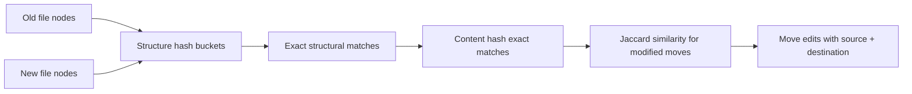

# Cross-File Correlation

A line diff cannot tell you that a function was deleted from `utils.ts` and recreated in `helpers.ts` — it shows a delete here and an insert there. The cross-file correlator runs after the per-pair diff, over the whole set of changed files, and answers the question: *did code move between files?*

## Stage 1: structure hash buckets

Every node from every old file and every new file is bucketed by structure hash. Two nodes in the same bucket have identical shape — same kind, same children — regardless of labels or values. Identical subtrees that appear in different files are exact moves: the same function body moved to another file with no edits is found here.



## Stage 2: content hash exact matches

Structure buckets say *shapes* match; content hashes say *code* matches. Within a structure bucket, nodes are compared by content hash — kind + label + value + children. A function moved unchanged to another file matches on both hashes, and the correlator emits a `Move` with source and destination file paths instead of a `Delete` plus an `Insert`.

Content hashes also catch renames at a distance: a renamed function whose body is untouched has a different label but identical children, so its content hash still matches the original's body subtree.

## Stage 3: Jaccard similarity for modified moves

The hard case is a function that moved *and* changed — new parameter, rewritten body, renamed. No hash matches. The correlator falls back to token-level Jaccard similarity between the old and new node's token sets:

```text
J(A, B) = |A ∩ B| / |A ∪ B|
```

The pair with the highest similarity above threshold — and no better match elsewhere — is reported as the move's origin. This is deliberately conservative: a low-similarity pairing is not reported, because a wrong move attribution is worse than none.

<Info>
Jaccard is only applied within the same structure family. A function candidate is never compared against a class or an import — the structure bucket from stage 1 constrains the search space before similarity scoring runs.
</Info>

## The edit action

Correlated moves surface as a single `Move` action carrying both paths:

| Field | Value |
| --- | --- |
| Action | `Move` |
| Label | `function "computeTotal"` |
| Source | `src/utils.ts` |
| Destination | `src/helpers.ts` |
| Change | `none` (hash match) or similarity score (Jaccard) |

The narration engine renders that as: *"moved `computeTotal` from `src/utils.ts` to `src/helpers.ts`"* — one sentence instead of two unrelated hunks.

## Current limitations

Leaf-level renames still report as a `Delete` plus an `Insert`. A single renamed identifier has no subtree to match on, so the correlator cannot pair it with confidence. The narration convention handles the cosmetic case: when a delete and an insert are the only changes in their respective parents, the narration renders *"renamed X to Y"* even though the underlying actions are separate. Exact-match granularity below the node level is on the roadmap.
