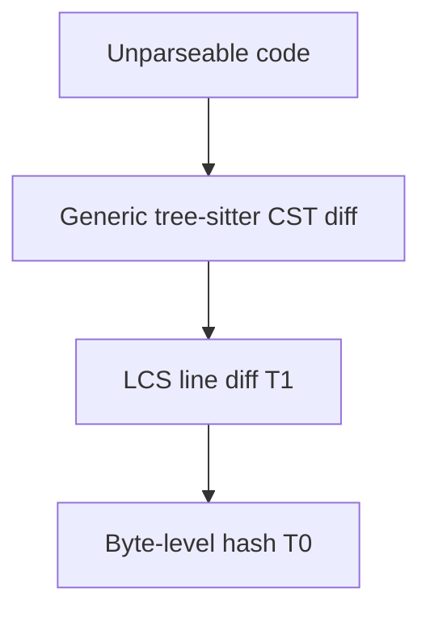

# Tier Pipeline

Differens parses files at six levels of abstraction, T0 through T5. Each tier is a parser that produces a `Node` tree. Each tier can fall back to the tier below it. The tier number is the abstraction ladder: T0 is bytes, T5 is code.

## The tiers

### T0: binary (hash-only)

Byte-level hash comparison. Used for images, fonts, archives, and anything else that fails the text sniff. Output is a single `Update` when the hash changes, with the byte-size delta as context. T0 never attempts to parse.

### T1: raw (LCS line diff)

The safety net: a line-level longest-common-subsequence diff over the raw text. It is the fallback for every tier above it. It is capped at 10,000 lines. Beyond that, T1 hands off to T0's hash-only comparison instead of running an unbounded LCS.

### T2: prose (word-level)

Word-level diff for plain text, Markdown, and logs. Paragraphs and sentences become tree nodes, so a moved paragraph is a `Move` instead of a delete-plus-insert. Punctuation and whitespace changes update leaf nodes rather than rewriting whole paragraphs.

### T3: markup (lenient HTML/XML)

A lenient HTML/XML tokenizer that tolerates malformed documents: unclosed tags, misnested elements, unescaped entities. Element hierarchy becomes the node tree. Attribute order changes are reorders, not updates.

### T4: data (JSON / YAML / TOML)

Value trees for JSON, the YAML subset Differens supports, and the TOML subset. The diff is key-path based: nested objects become nested nodes, so a key moved between two objects reports as a `Move` with the key path in the label. Array reordering is a `Reorder`.

### T5: code (tree-sitter)

A tree-sitter CST with per-language semantic extractors. The extractors map raw tree-sitter node types to canonical concepts such as `Function`, `Class`, `Method`, and `Import`. The narration can then say "function" whether the source said `fn`, `def`, or `func`. Currently: TypeScript/JavaScript, Python, Rust, and Go.

Languages without an extractor still work at the generic level: structural diff with raw tree-sitter node type labels. The extractor only adds human-readable concept names.

## Graceful degradation

The tiers form a chain. Each tier can hand off to the tier below it:

1. **T5 parse fails** (syntax error, unsupported construct) → fall back to a generic tree-sitter CST diff, still structural.
2. **Generic CST fails** (no tree-sitter grammar, garbage input) → T1 line diff.
3. **T1 hits the 10k-line cap** → T0 hash-only comparison.

The worst case is a byte-level comparison. It is less informative than a structural diff, but it still runs.

## Classification rules

The content router classifies by extension, then by content sniff:

| Rule | Tier |
| --- | --- |
| Binary sniff fails (NUL bytes, invalid UTF-8) | T0 |
| `.png .jpg .gif .webp .pdf .zip .gz .tar` | T0 |
| Everything else, default | T1 |
| `.md .mdx .txt .log .rst` | T2 |
| `.html .htm .xml .svg` | T3 |
| `.json .jsonc .yaml .yml .toml` | T4 |
| `.ts .tsx .js .jsx .mjs .cjs` | T5 |
| `.py` | T5 |
| `.rs` | T5 |
| `.go` | T5 |

Extension-based classification is the first cut; the content sniff is the backstop. A `.txt` file that is actually minified JSON still gets a T2 word-level diff. That is acceptable, because the tier below can take over.

## Tier summary

| Tier | Handles | Fallback |
| --- | --- | --- |
| T0 | Binary files, hash-only comparison | (floor) |
| T1 | Raw text, LCS line diff, 10k-line cap | T0 hash-only |
| T2 | Prose, Markdown, logs, word-level diff | T1 line diff |
| T3 | HTML/XML, lenient tokenizer | T1 line diff |
| T4 | JSON/YAML/TOML, key-path diff | T1 line diff |
| T5 | Code, tree-sitter + semantic extractors | T1 line diff (or generic CST) |

<Info>
Adding a tier adapter: create the adapter in `packages/tiers/src/`, produce a `Node` tree (the interface lives in `packages/core/src/index.ts`), register it in the `diffWithTier()` switch in `packages/tiers/src/index.ts`, and add extension rules to `classifyFile()`. The tier number should reflect its position on the abstraction ladder.
</Info>
