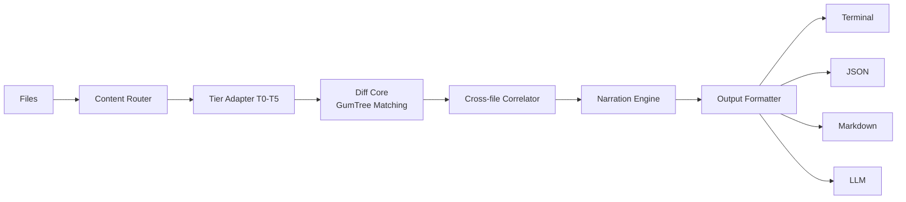

# Introduction

Differens is a semantic diffing engine. Instead of comparing lines of text, it parses files into trees, matches nodes structurally, and reports what actually changed: renamed, moved, extracted, or reformatted. Not which lines changed.

## The problem: line diffs lie

Open any pull request and you will see the same pattern:

```diff
- function computeTotal(items: Item[]): number {
-   return items.reduce((acc, item) => acc + item.price, 0);
+ function calculateTotalAmount(items: Item[], discount: number): number {
+   const base = items.reduce((acc, item) => acc + item.price, 0);
+   return base - discount;
  }
```

Renames, moves, extractions, and reformats all show up as a delete plus an insert. A one-word rename looks like the whole function was rewritten. A function moved to another file looks like it was deleted in one place and copy-pasted in another. Line diffs describe where text changed, never what changed.

Differens answers the question line diffs cannot: **what did the author actually do?**

## How it works

Four stages:

1. **Parse**. A content router picks the right tier adapter (binary, raw text, prose, markup, data, or code) and parses each file into a tree.
2. **Match**. The diff core runs GumTree-lineage tree matching: top-down isomorphic matching for anchors, bottom-up container matching for the rest, then a Chawathe edit script over the match sets.
3. **Correlate**. The cross-file correlator finds code that moved between files, tracking renames and moves across the whole working tree.
4. **Narrate**. The narration engine turns the typed edit script into English, for example "renamed `computeTotal` to `calculateTotalAmount` and added parameter `discount`". Not "removed 3 lines, added 5 lines".



## When to use Differens

Line diffs are fine when you just want to see which lines changed. Differens earns its keep where intent matters. These are the situations where it pays for itself.

### AI agents and coding assistants

Agents read diffs to work out what a change did. `git diff` makes them reconstruct intent from delete-plus-insert pairs, and it is expensive. On this repo's own 14-file changeset, `git diff` produces 100KB; the LLM format produces 6.5KB, about 15x smaller. One line per change, every rename and move named, source line attached to each:

```bash
differens main..feature --format=llm
```

```text
differens/1 2 files 5 changes 4 named
# src/checkout.ts
~ function computeTotal :12 < class Checkout computeTotal -> calculateTotalAmount
+ function applyDiscount :40
# cross-file
> formatPrice src/old/utils.ts -> src/new/utils.ts
```

The model starts from "renamed this, added that, moved the other" instead of raw line noise. Less context burned, fewer wrong inferences, cheaper runs. Agents should reach for `--format=llm` first, and fall back to `git diff` only when they need the raw text around a change.

### Code review

A rename inside a reformatted block shows up as forty lines of churn in `git diff`. Differens reports one action: `renamed function computeTotal to calculateTotalAmount`. Reviewers stop hunting through formatting noise for the real change, so reviews finish faster and catch actual problems instead of diff fatigue.

### Refactoring across files

Moving code between files is a delete in one file plus an insert in another to every line diff. Differens correlates the two sides and reports `moved function validate from utils.ts to validators.ts`, and it flags when the function was edited in transit. After a big refactor you can confirm nothing changed except where it lives, instead of eyeballing thousands of lines.

### PR descriptions and changelogs

`differens main..feature --format=markdown` writes a ready-to-paste PR description: one heading per file, one bullet per change. Nobody has to write "what did I change" from memory again, and the summary always matches the diff because it is generated from it.

### Config and data churn

JSON, YAML, and TOML get key-path diffs: `changed database.pool.max from 10 to 25`. A dependency bump that touches a thousand-line lockfile reports the keys that actually moved instead of a wall of pluses and minuses. Config reviews become readable.

### Docs and prose

Plain text and logs diff at the word level, with paragraphs as nodes. A paragraph moved between sections is a `Move`, not a delete plus an insert, and a rewording updates leaf nodes instead of rewriting the paragraph. Editing documentation stops looking like the whole file changed.

### CI and automation

Output is deterministic and machine-readable, so CI can diff every commit and post the summary into the PR. Formatting-only changes collapse to "reformatted only, no logical changes", which keeps release notes honest without a human reading the diff.

## Project status

Differens is at **v0.1.0** with 100+ tests. It is under active development: parsing coverage, matching quality, and output formats are evolving quickly.

<Warning>
Differens is **early-stage software**. The API, CLI flags, and output formats may change between minor releases. Expect rough edges in tree matching on unusual code, and pin the version you depend on if you build on the libraries.
</Warning>

## Next steps

- [Quickstart](/getting-started/quickstart): run your first semantic diff in under a minute
- [Installation](/getting-started/installation): install the CLI and libraries
- [How it works](/how-it-works/architecture): the architecture, tree matching, tier pipeline, and cross-file correlation in depth
