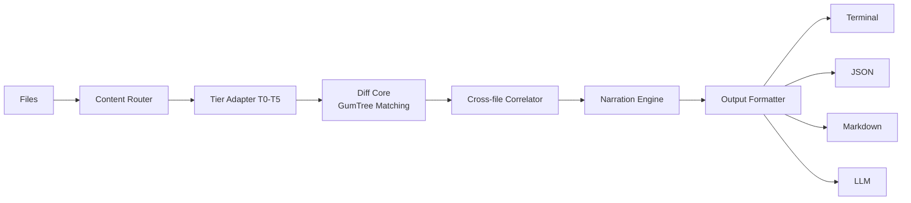

# Introduction

Differens is a semantic diffing engine. Instead of comparing lines of text, it parses files into trees, matches nodes structurally, and reports what actually changed: renamed, moved, extracted, or reformatted. Not which lines changed.

## The problem: line diffs lie

Open any pull request and you will see the same pattern:

```diff
- function computeTotal(items: Item[]): number {
-   return items.reduce((acc, item) => acc + item.price, 0);
+ function calculateTotalAmount(items: Item[], discount: number): number {
+   const base = items.reduce((acc, item) => acc + item.price, 0);
+   return base - discount;
  }
```

Renames, moves, extractions, and reformats all show up as a delete plus an insert. A one-word rename looks like the whole function was rewritten. A function moved to another file looks like it was deleted in one place and copy-pasted in another. Line diffs describe where text changed, never what changed.

Differens answers the question line diffs cannot: **what did the author actually do?**

## How it works

Four stages:

1. **Parse**. A content router picks the right tier adapter (binary, raw text, prose, markup, data, or code) and parses each file into a tree.
2. **Match**. The diff core runs GumTree-lineage tree matching: top-down isomorphic matching for anchors, bottom-up container matching for the rest, then a Chawathe edit script over the match sets.
3. **Correlate**. The cross-file correlator finds code that moved between files, tracking renames and moves across the whole working tree.
4. **Narrate**. The narration engine turns the typed edit script into English, for example "renamed `computeTotal` to `calculateTotalAmount` and added parameter `discount`". Not "removed 3 lines, added 5 lines".



## When to use Differens

- **Code review**. See the intent behind a change, not the churn. A rename surrounded by reformatting is one action, not forty lines.
- **PR summaries**. The narration engine writes a human summary of every change in a commit range.
- **Refactor tracking**. Confirm a refactor moved code without changing it, and find where it went across files.
- **AI context**. Feed the compact LLM output format to agents and models so they reason about changes instead of diff noise.

## Project status

Differens is at **v0.1.0** with 100+ tests. It is under active development: parsing coverage, matching quality, and output formats are evolving quickly.

<Warning>
Differens is **early-stage software**. The API, CLI flags, and output formats may change between minor releases. Expect rough edges in tree matching on unusual code, and pin the version you depend on if you build on the libraries.
</Warning>

## Next steps

- [Quickstart](/getting-started/quickstart): run your first semantic diff in under a minute
- [Installation](/getting-started/installation): install the CLI and libraries
- [How it works](/how-it-works/architecture): the architecture, tree matching, tier pipeline, and cross-file correlation in depth
